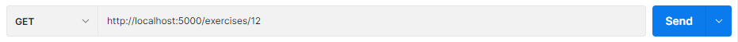
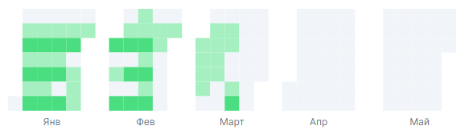
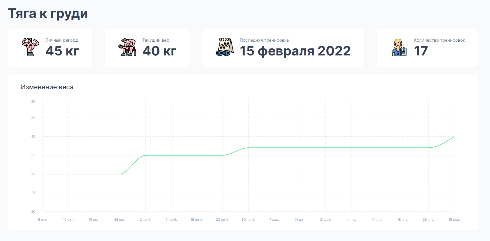
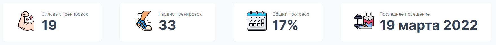
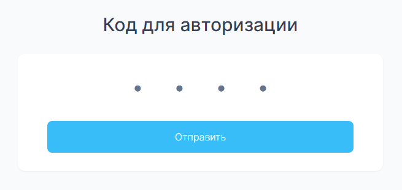
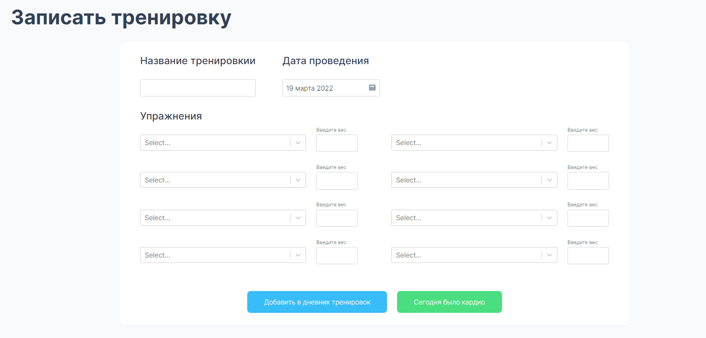

# PERN Workouts Dashboard
An application made for tracking fitness progress that includes chart for every exercise, authentication and calendar heatmap.

## Demo
Deployed on Heroku — [rurouni](https://rurouni.herokuapp.com/)

##  General info
The PERN stack: [PostgresSQL](https://www.postgresql.org/), [Express](https://expressjs.com/), [React](https://reactjs.org/) and [Node](https://nodejs.org/en/)

 - [Recharts](https://recharts.org/en-US/)  - charting library built on React components
 - [Nivo/calendar](https://nivo.rocks/calendar/)  - data visualization component built on top of D3.js
 - [Date-fns](https://date-fns.org/)  - library for formatting dates
 - [React Modal](https://www.npmjs.com/package/react-modal)  - modal dialog component for React
 - [React Select](https://react-select.com/)  -  select input compinent liblary
 - [React Datepicker](https://reactdatepicker.com/)  -  a simple and reusable datepicker component for React
 - [JWT](https://jwt.io/)  - A standard to secure/authenticate HTTP requests
 
 ## Features
 
 - All data stored in PostgreSQL database
 - Data driven calendar heatmap
 - Stats for each exercise and for general progress (such as last visit date or personal record)
 - Dynamic search
 - Progress chart for every exercise
 - Workouts history section
 - Authentication using jsonwebtoken
 - Authorized users get access to the admin panel

 ## Overview
 ---
 #### Backend
Example of API endpoint that GETs item by id:
```javascript
//get exercise
app.get ('/exercises/:id', async (req, res) => {
  try {
    const { id } = req.params;
    const getExercise = await pool.query("SELECT * FROM exercise WHERE id = $1", [id]);
    res.json(getExercise.rows[0]); 
    
  } catch (err) {
    console.error(err.message);  
  }
});

```

Wich leads to this raw json data
```JSON
{
    "id": 12,
    "name": "Бицепс со штангой",
    "weight": 20,
    "personal_record": 30,
    "primary_tag": "Бицепс",
    "secondary_tag": null,
    "units": "кг",
    "history": [
        {
            "date": "2021-10-05",
            "weight": 20
        },
        {
            "date": "2021-10-12",
            "weight": 20
        },
        {
            "date": "2021-10-19",
            "weight": 20
        },
```
---
This query checks and updates an exercise personal record value:
```javascript
  // update personal records
  try {
    const newValues = await pool.query(
      "UPDATE exercise 
        SET personal_record =  CASE WHEN weight > personal_record THEN weight ELSE personal_record END");
    res.json(newValues.rows[0]);  
  } catch (err) {
    console.error(err.message);
  }
```
---
#### Frontend
The frontend incorporates custom design and architecture. The application was designed for desktop use so responsive design is not needed. 

Example of a fetch hook to load a data for calendar heatmap:
```javascript
  const [records, setRecords] = useState([]);

  const getRecords = async () => {
    try {
      const response = await fetch("/calendar");
      const jsonData = await response.json();

      setRecords(jsonData);
    } catch (err) {
      console.error(err.message);     
    }
  }

  useEffect(() => {
    getRecords();
  }, []);
```


---
##### Screenshots
Exercise Page:


---
Stats Section on Profile Page:


---
Login Page for Unauthorized Users:


---
Login Page for Authorized Users:

